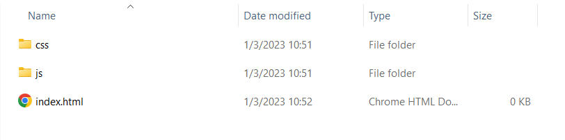

<!-- prettier-ignore -->
# Introduction

---

<!-- prettier-ignore -->
## Arranging code

- Folders are part of the filename
- Good arrangment makes it easier for ourselves and others to understand programs.
- https://example.com == https://example.com/index.html

---

<!-- prettier-ignore -->
## Filetypes in web development

- HTML
- CSS
- JS
- Other filetypes for assets.

---

<!-- prettier-ignore -->
## Example



---

<!-- prettier-ignore -->
## Index files

- Landing page
- Root folder
- Host service decides what names can be used. (index.html, home.html, start.html)

---

<!-- prettier-ignore -->
## URL

- Location of folder on a server

---

<!-- prettier-ignore -->
## Adding scripts

<!-- prettier-ignore -->
```html
<head>
    <script defer src="/js/script.js"></script>
</head>
```

or

<!-- prettier-ignore -->
```html
<body>
    <!-- Your html content -->

    <script src="/js/script.js"></script>
</body>
```

---

<!-- prettier-ignore -->
## Development console

### Open with

- Right click > inspect
- f12
- ctrl+shift+j

---

<!-- prettier-ignore -->
## console

- Shows error messages
- Test functions and check variables (scripting)

---

<!-- prettier-ignore -->
## JavaScript

<!-- prettier-ignore -->
```js
// One line comments

/* multi line
comments */ 
let semikolon = ";"; //Are "optional" but use them.

```
